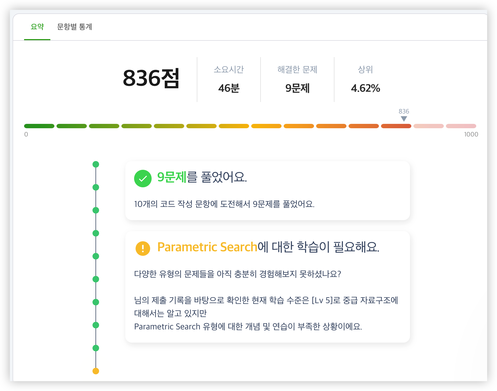

# 2023-08-04 Week 4 배운 점 정리

# 코드트리 진단평가 참여



총 10문제 중 9문제를 해결하였습니다. 마지막 1문제는 Parametric Search 라는 것을 눈치채기는 했지만, 구현이 조금 까다로워 문제를 맞추지는 못하였습니다. 저번 모각소 때도 Parametric Search에 관해서 공부를 했었지만, 아직 부족하기 때문에 더욱 더 공부를 열심히 해야겠다는 생각이 들었습니다.


# 이진 탐색 (Parametric Search)

+ [삼 오 무](https://www.codetree.ai/missions/8/problems/three-five-moo?utm_source=clipboard&utm_medium=text)

```cpp
#include <bits/stdc++.h>

using namespace std;

long long n;

long long func(long long mid) {
    long long cnt = mid / 3 + mid / 5 - mid / 15;

    return mid - cnt;
}

int main() {
    cin >> n;
    long long left = 1;                        
    long long right = INT_MAX;                   
    long long res = INT_MAX;             

    while (left <= right) {                   
        long long mid = (left + right) / 2;  
        if(func(mid) >= n) {       
            right = mid - 1;                 
            res = min(res, mid);     
        }
        else                               
            left = mid + 1;            
    }

    cout << res;                    
    return 0;
}
```

+ [이차원 배열의 오름차순 정리](https://www.codetree.ai/missions/8/problems/ascending-order-of-two-dimensional-array?utm_source=clipboard&utm_medium=text)

```cpp
#include <bits/stdc++.h>

using namespace std;

long long n, k;

int main() {
    cin >> n;
    cin >> k;
    
    long long lo = 1;                 
    long long hi = n * n;         
    long long ans = n * n;  
    
    while(lo <= hi) {              
        long long mid = (lo + hi) / 2;  
        
        long long val = 0;
        for(int i = 1; i <= n; i++) val += min(n, mid / i);
        
        if(val >= k) {                      
            hi = mid - 1;                    
            ans = min(ans, mid);            
        } else lo = mid + 1;                 
    }
    
    cout << ans;
}
```